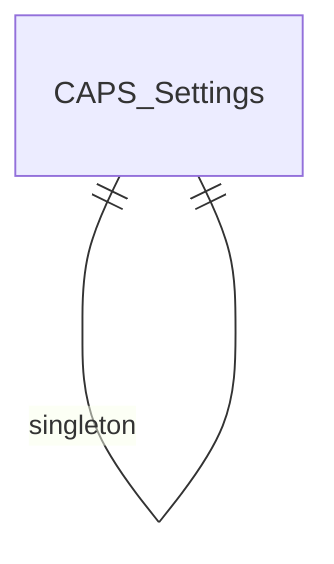

# CAPS — Entity Relationship Diagram
# كابس — مخطط العلاقات

> 24 DocTypes

> **Note:** This is a placeholder ERD. Update with actual DocType relationships from the JSON definitions.
> Run: `ls caps/caps/*/doctype/` to discover all DocTypes and their Link fields.
